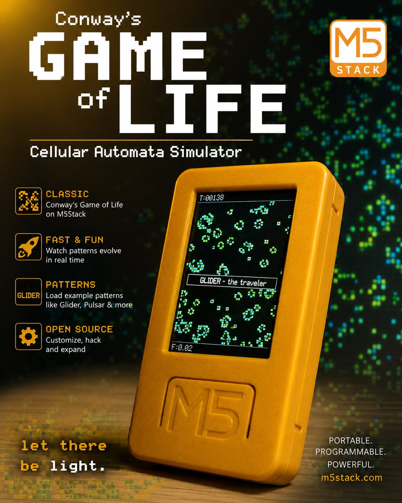
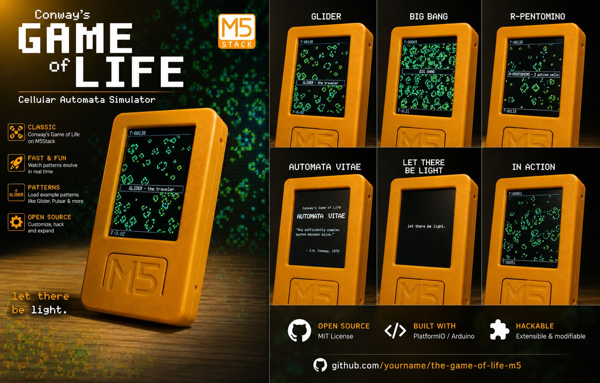

<p align="center">
  
</p>

<p align="center">
  
  
  
  
</p>

<h3 align="center">
  A cellular automata simulator for the M5StickC Plus2.<br/>
  Portable. Programmable. Alive.
</h3>

---

## Overview

Conway's Game of Life running on the **M5StickC Plus2** — a pocket-sized ESP32 device with a 1.14" color display, here used in **portrait** (135×240). Every cell ages and changes color over time. Classic patterns can be injected on the fly. The simulation resets only when life truly goes extinct.

A tribute to **John Horton Conway** (1937–2020).

> *"Any sufficiently complex system is indistinguishable from life."*  
> — J.H. Conway, 1970

---

## Screenshots

<p align="center">
  
</p>

---

## Features

- **Cell aging** — 5-color gradient from cyan (newborn) through green to amber (ancient)
- **Toroidal grid** — edges wrap, no boundaries, pure Conway B3/S23
- **Differential rendering** — only changed cells are redrawn, smooth at 80ms/gen default
- **Pattern injection** — Glider, R-Pentomino, Acorn, Pulsar injected live without resetting
- **Generational toasts** — on-screen feedback for every action and milestone
- **Iconic splash screen** — boot sequence with tribute text before the simulation starts
- **Auto-extinction reset** — simulation restarts only when fewer than 8 cells survive for 40 consecutive generations
- **Speed control** — 3 presets cycled at runtime

---

## Hardware

| Component | Details |
|-----------|---------|
| **Board** | M5StickC Plus2 |
| **MCU** | ESP32-PICO-V3-02 @ 240MHz |
| **Display** | 1.14" ST7789 color TFT, 135×240 (portrait) |
| **Flash** | 8MB |
| **Framework** | Arduino via PlatformIO |

---

## Getting Started

### Requirements

- [VS Code](https://code.visualstudio.com/) + [PlatformIO extension](https://platformio.org/install/ide?install=vscode)
- M5StickC Plus2 connected via USB-C

### Clone & Flash

```bash
git clone https://github.com/yourname/the-game-of-life-m5
cd the-game-of-life-m5
pio run --target upload
```

PlatformIO will automatically download all dependencies (`M5StickCPlus2`, `M5Unified`, `M5GFX`) on first build.

### Serial Monitor

```bash
pio device monitor
```

---

## Controls

| Button | Short Press | Hold |
|--------|-------------|------|
| **BtnA** (front) | Inject next pattern | Cosmic Reset — new random universe |
| **BtnB** (side) | Cycle speed preset | — |
| **BtnPWR** | — | Power off (handled by M5Unified) |

### Pattern Cycle (BtnA)

Each press injects the next pattern at the center of the grid without clearing the simulation:

| # | Pattern | Cells | Description |
|---|---------|-------|-------------|
| 0 | **Glider** | 5 | The traveler — moves diagonally forever |
| 1 | **R-Pentomino** | 5 | Chaotic — stabilizes after 1103 generations |
| 2 | **Acorn** | 7 | Grows for 5206 generations before stabilizing |
| 3 | **Pulsar** | 48 | Period-3 oscillator — one of the most recognizable |

### Speed Presets (BtnB)

| Preset | Delay | Feel |
|--------|-------|------|
| Fast | 80ms | Default |
| Medium | 120ms | Contemplative |
| Slow | 200ms | Visual debug |

---

## Project Structure

```
├── boards/
│   └── m5stick-c-plus2.json   custom board definition (ESP32-PICO-V3-02, 8MB)
├── src/
│   └── main.cpp               full simulation source
├── platformio.ini             build configuration
├── cover_GOL.PNG
├── images_GOL.PNG
└── README.md
```

> The `boards/` folder contains a custom PlatformIO board definition for the Plus2,  
> which does not yet have an official entry in the PlatformIO board registry.

---

## Tunable Constants

All in `src/main.cpp`:

| Where | Default | Description |
|-------|---------|-------------|
| `CELL` | `2` | Pixels per cell side (try 3 for a coarser grid) |
| `COLS` / `ROWS` | `67` / `114` | Grid dimensions (portrait) |
| `random(100) < 32` in `bigBang()` | `32` | % live cells at startup |
| `SPEEDS[]` | `{80, 120, 200}` | Speed presets in ms |
| `< 8` / `>= 40` in `loop()` | `8` / `40` | Extinction reset: min cells / consecutive gens |

---

## Cell Aging Colors

Defined in `ageToColor()` (RGB565 values):

| Age (generations alive) | Color |
|-------------------------|-------|
| 0 (newborn) | 🩵 Cyan `0x07FF` |
| 1–4 | 💚 Bright green `0x07E0` |
| 5–15 | 🟢 Mid green `0x0640` |
| 16–34 | 🌲 Dark green `0x0300` |
| 35+ | 🟡 Amber `0xFD40` |

---

## How It Works

The simulation runs **Conway's B3/S23** rule on a toroidal grid:

- A **dead cell** with exactly 3 live neighbors is **born**
- A **live cell** with 2 or 3 live neighbors **survives**
- All other cells die or stay dead

Rendering is differential: only pixels that change state (or change age-color) are redrawn each frame, keeping the display update fast on an SPI bus.

---

## Open Source

MIT License — fork it, hack it, expand it.

Built with [PlatformIO](https://platformio.org) · [M5Unified](https://github.com/m5stack/M5Unified) · [M5GFX](https://github.com/m5stack/M5GFX)

---

<p align="center">
  <strong>let there be light.</strong><br/>
  <sub>m5stack.com &nbsp;·&nbsp; github.com/yourname/the-game-of-life-m5</sub>
</p>
